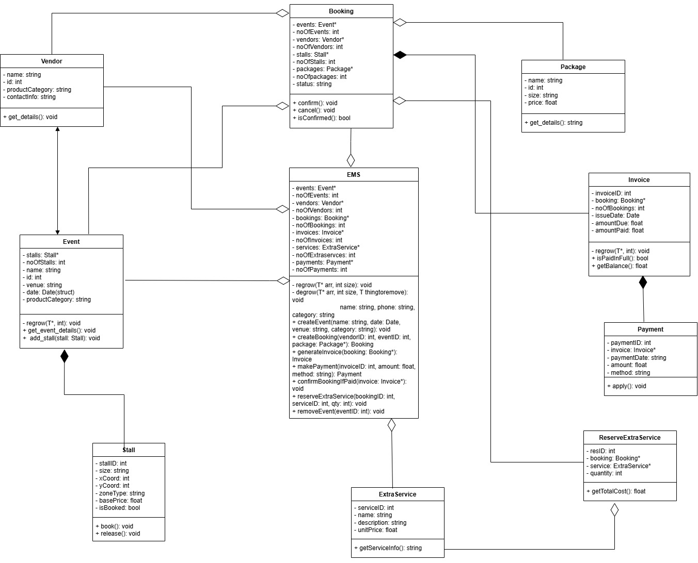
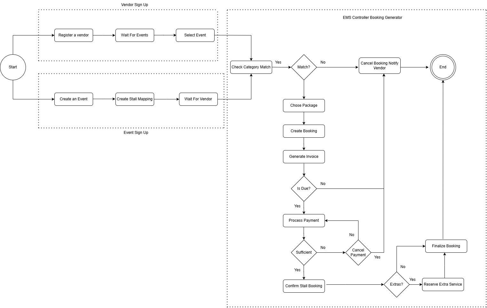

# Event Stall Management System (EMS)

This project is a simulation of a real-world event management system where vendors can register for themed events and book commercial stalls, with optional extra services. It’s designed to mimic workflows used in large event expos, where stall logistics, category alignment, payments, and package selection all play a role.

The system is structured using **Object-Oriented Programming** principles, and will be implemented in **C++** with proper class definitions and interactions as planned in the UML model.

---

## UML Class Diagram

The UML diagram provides a **pre-coding blueprint** of the object model that will power the EMS. It defines classes such as `Vendor`, `Event`, `Booking`, `Invoice`, `Payment`, `Stall`, `ExtraService`, and the main `EMS` controller class which coordinates them.

Each class includes its relevant attributes and core methods (e.g., `registerVendor`, `confirmBooking`, `applyPayment`, etc.).

> This UML is an **initial version** designed before writing code. As development progresses, this structure may be **updated** or expanded based on actual implementation needs, bug handling, or feature requests.

---

## Activity Diagram

The activity diagram above outlines a **single general flow** through the EMS booking system. It begins with **parallel sign-ups**: one from the **vendor**, and one from the **event admin**. Once both are ready, the EMS checks if the vendor's product category matches the event's theme.

If matched, the vendor chooses a package, makes payment, and can optionally book extra services. The flow ends with finalizing the booking.

> **Note:** This diagram currently shows just **one core case** for how bookings are processed. In actual implementation, this flow would be **repeated** for every vendor–event pair. Additional checks (timeouts, error handling, stall reallocation, etc.) can be added later to expand the EMS’s capabilities.
